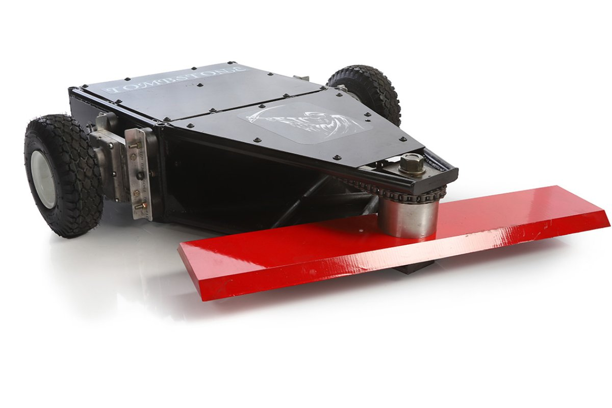
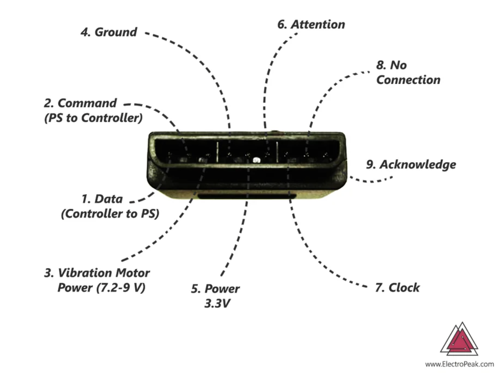
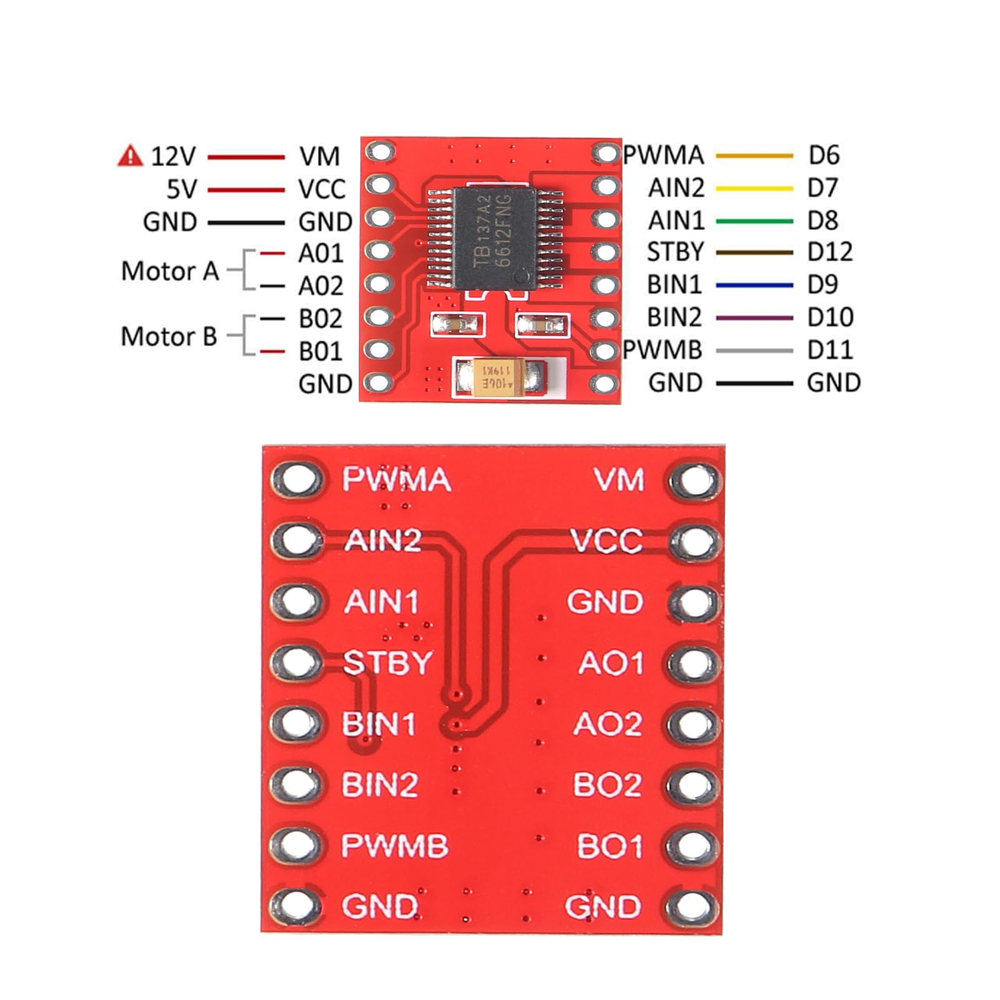
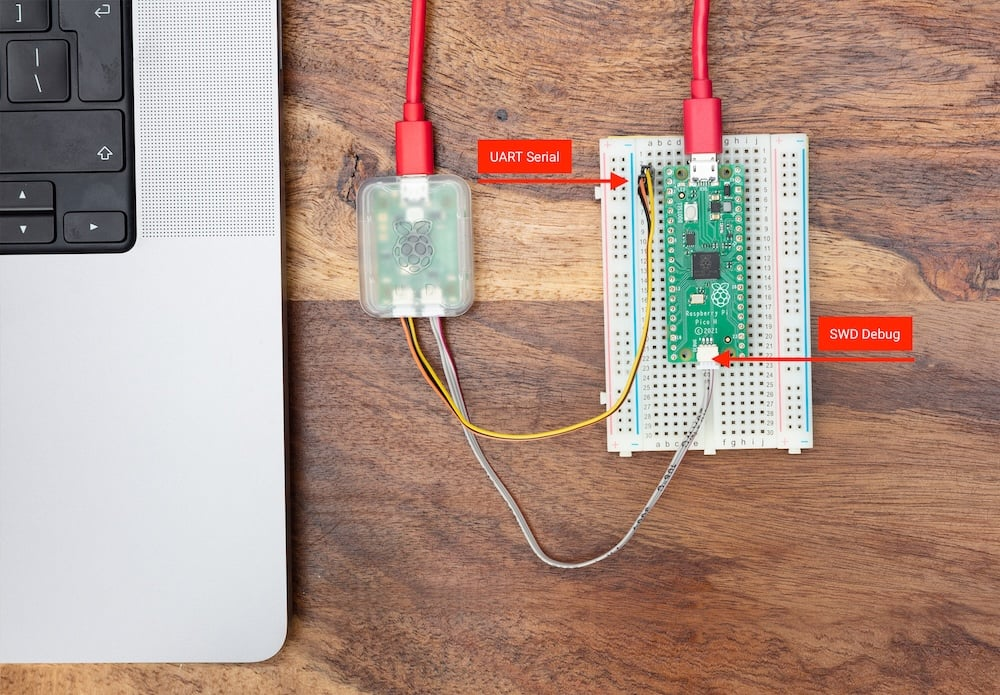
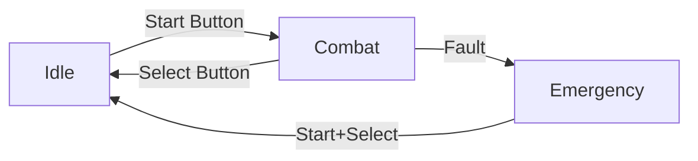

# Rust in Peace 🦀⚔️
## Building a Battle Bot with Embedded Rust

Rex

---

# Fighting Robots! 🤖

<div class="columns">
<div>

## What are Battle Bots?

- Remote-controlled combat robots
- Weight classes (typically 1lb - 250lb)
- NOT autonomous - human controlled for safety

<!-- 
Speaker notes: Add your favorite battle bot video link here
Show: [VIDEO LINK HERE]
-->

</div>
<div>



</div>
</div>

---

# Types of Battle Bots 🛠️

## Popular Weapon Designs

- **Spinners** - Horizontal/vertical spinning discs (Tombstone, Bite Force)
- **Flippers** - Pneumatic launchers (Hydra, Bronco)
- **Hammers** - Axe/hammer weapons (Blacksmith, Chomp)
- **Control Bots** - Push/grab strategy (Duck!, HUGE)
- **Full-body Spinners** - Entire bot rotates (Captain Shrederator)

*Each design has trade-offs: damage vs. control vs. reliability*

---

# How to Build a (Bad) Fighting Robot

Let's be honest - our first bot won't win championships

But it will:
- ✅ Move
- ✅ Spin
- ✅ Not catch fire (hopefully)
- ✅ Teach us embedded systems!

---

# Choosing Your Brain 🧠

<div class="columns">
<div>

## Microcontroller Options
- **Arduino** - Simple but limited
- **ESP32** - Need xtensa compiler fork

## Why RP2040?
- Two cores = separate input/control
- Great Embassy support
- Tons of documentation

</div>
<div>


</div>
</div>

---

# Remote Control Options 🎮

<div class="columns">
<div>

**RC Transmitter** 
- Traditional, reliable
- Expensive ($100+)
- PPM/PWM signals need decoding

**WiFi or BLE**
- Phone/computer control
- Complex, latency issues

</div>
<div>

**Game Controller** ✅
- Cheap, familiar interface
- PS2 controllers are well-documented
- Easy SPI communication
- No pairing needed
- Predictable latency

</div>
</div>

---

# PS2 Controller Communication 🎮

<div class="columns">
<div>

## How It Works
- 2.4GHz wireless from controller to receiver
- SPI Protocol at 500kHz to microcontroller
- Sends buttons, analog sticks, pressure data
- Receives rumble motor commands
- 3.3V compatible (perfect for RP2040!)

</div>
<div>



</div>
</div>

---

# Motor Drivers & Power 🔌

<div class="columns">
<div>

## Motor Driver: TB6612FNG
- Dual H-Bridge motor driver
- PWM speed control
- Direction control via logic pins

## Power Requirements
- Logic: 3.3V from RP2040
- Motors: [YOUR VOLTAGE]
- Battery: [YOUR BATTERY SPECS]

</div>
<div>



</div>
</div>

---

# Choosing Your Firmware Language

<div class="columns">
<div>

## C - The Classic
✅ Mature, tons of examples
✅ Direct hardware control
❌ Memory unsafe
❌ Manual memory management

</div>
<div>

## MicroPython
✅ Easy to learn
✅ REPL for testing
❌ Slow, high memory use
❌ Not real-time

</div>
</div>

---

# Why Rust? 🦀

## The Best of Both Worlds

✅ **Memory Safe** - No segfaults or buffer overflows
✅ **Fast as C** - Zero-cost abstractions
✅ **Modern** - async/await for embedded
✅ **Type System** - Catches bugs at compile time
❌ **Learning Curve** - But worth it!

---

# Embassy Framework

<div class="columns">
<div>

> "Next-generation framework for embedded applications"

## What Embassy Gives Us:
- `async`/`await` for embedded
- Hardware abstraction layers (HAL)
- Built-in drivers
- Power efficiency
- Multi-core support

</div>
<div>

```rust
#[embassy_executor::task]
async fn blink_led(pin: AnyPin) {
    let mut led = Output::new(pin);
    loop {
        led.toggle();
        Timer::after_millis(500).await;
    }
}
```

Simple, readable async code!

</div>
</div>

---

# Project Setup 📁

<div class="columns">
<div>

## Dependencies
```toml
# Cargo.toml
[dependencies]
embassy-executor = "0.7.0"
embassy-rp = "0.4.0"
embassy-time = "0.4.0"
embassy-sync = "0.7.0"
tb6612fng = "1.0.0"
```

</div>
<div>

## Tools & Running
```bash
# Install tools
cargo install probe-rs-tools

# Flash and run
cargo run --release

# Debug output
probe-rs attach --chip RP2040
```

</div>
</div>

---

# Architecture Overview

## Dual-Core Design 🧠🧠

```
┌─────────────┐         ┌──────────────┐
│   Core 0    │ Channel │    Core 1    │
│             │ ──────> │              │
│ PS2 Input   │         │ State Machine│
│ LED Status  │         │ Motor Control│
│             │         │ Servo Control│
└─────────────┘         └──────────────┘
```

**Core 0:** Read inputs, indicate status
**Core 1:** Process commands, drive hardware

---

# Component Architecture

```rust
src/
├── main.rs          // Setup and core spawning
├── input.rs         // PS2 controller reading
├── control.rs       // State machine + drivers  
├── events.rs        // Message definitions
├── utils.rs         // Helper functions
└── hardware/        // Low-level details (hidden)
    ├── peripherals.rs
    ├── motor_controller.rs
    └── servo_controller.rs
```

---

# Reading PS2 Controller 🎮

```rust
#[embassy_executor::task]
pub async fn ps2_reader_task(spi_peripherals, sender) {
    let mut psp = PlayStationPort::new(spi, cs);
    
    loop {
        let device = psp.read_input(Some(&motor_cmd)).await;
        let Device::DualShock2(controller) = device;
        
        sender.send(ControllerData {
            left_stick_x: controller.lx,
            left_stick_y: controller.ly,
            buttons: controller.buttons.bits(),
        }).await;
    }
}
```

---

# Event-Driven Design 📬

```rust
pub enum TankDriveEvent {
    Move { x: i8, y: i8 },
    Stop,
    Enable,
    Disable,
}

pub enum ServoEvent {
    SetAngle(u8),  // 0-180 degrees
}

pub enum LedEvent {
    Off,
    SlowBlink,
    FastBlink,  
    Solid,
}
```

---

# State Machine - The Brains 🧠

```rust
pub enum BotState { Idle, Combat, Emergency }

match current_state {
    BotState::Idle => {
        if buttons.start() {
            current_state = BotState::Combat;
            tank_sender.send(TankDriveEvent::Enable);
        }
    }
    BotState::Combat => {
        process_movement(&data, &tank_sender);
        // Your weapon control here!
    }
}
```

---

# Tank Drive Math 🚗

```rust
pub async fn process_movement(data: &ControllerData, sender: &Sender<TankDriveEvent>) {
    let x = data.left_stick_x as i16 - 128;
    let y = -(data.left_stick_y as i16 - 128);
    
    if x.abs() < DEADZONE && y.abs() < DEADZONE {
        sender.send(TankDriveEvent::Stop).await;
    } else {
        // Arcade drive: forward/back + rotation
        let drive = (y / 2) as i8;
        let turn = (x / 2) as i8;
        sender.send(TankDriveEvent::Move { 
            x: turn, y: drive 
        }).await;
    }
}
```

---

# PWM Motor Control ⚡

How do we control motor speed with digital signals?

```
100% Speed: ▓▓▓▓▓▓▓▓▓▓▓▓▓▓▓▓
 75% Speed: ▓▓▓▓▓▓▓▓▓▓▓▓░░░░
 50% Speed: ▓▓▓▓▓▓▓▓░░░░░░░░
 25% Speed: ▓▓▓▓░░░░░░░░░░░░
```

**PWM** = Pulse Width Modulation
- Frequency: How fast we switch (typically 1-20kHz)
- Duty cycle: % of time signal is HIGH

<!-- Add oscilloscope screenshot if you have one -->

---

# Safety Features 🛡️

<div class="columns">
<div>

## Multiple Layers of Protection

1. **State Machine** - Emergency stop state
2. **Channel Buffers** - Commands don't pile up
3. **Deadman Switch** - Stop if no input
4. **Voltage Monitoring** - [TO BE IMPLEMENTED]

</div>
<div>

```rust
BotState::Emergency => {
    led_sender.send(LedEvent::Solid).await;
    tank_sender.send(TankDriveEvent::Disable).await;
    
    // Require deliberate reset
    if buttons.start() && buttons.select() {
        current_state = BotState::Idle;
    }
}
```

</div>
</div>

---

# Running on Hardware 🔧

<div class="columns">
<div>

## Required: Raspberry Pi Debug Probe
- Official Pico Debug Probe for SWD debugging
- Connects to RP2040's debug pins
- ~$12 from official distributors
- Enables flashing and real-time debugging

</div>
<div>



</div>
</div>

---

# Build & Flash Commands

```bash
# Build for RP2040 target
cargo build --release --target thumbv6m-none-eabi

# Flash with probe-rs (via Debug Probe)
probe-rs run --chip RP2040 --release

# Debug output via RTT
probe-rs attach --chip RP2040
```

<!-- Add photo of your actual bot here! -->

---

# Lessons Learned 📚

<div class="columns">
<div>

## What Worked ✅
- Dual-core separation of concerns
- Event-driven architecture
- Embassy async tasks

## Challenges 🤔
<!-- Fill in your specific challenges -->
- [YOUR CHALLENGE 1]
- [YOUR CHALLENGE 2]

</div>
<div>

## Next Improvements 🚀
- Add current sensing for safety
- Implement weapon control
- [YOUR IDEA HERE]
- [YOUR IDEA HERE]

</div>
</div>

---

# Demo Time! 🎮

<!-- Add demo video or live demo notes -->

## Let's see it move!

1. Power on sequence
2. PS2 controller connection
3. Basic movement
4. Spin demonstration
5. Emergency stop

[DEMO VIDEO/LIVE DEMO]

---

# Resources 📖

## Learn More:
- **Embassy**: https://embassy.dev
- **RP2040**: https://www.raspberrypi.com/documentation/microcontrollers/rp2040.html
- **probe-rs**: https://probe.rs
- **This project**: https://github.com/stargazing-dino/rust_in_peace

## Battle Bot Communities:
- [YOUR LOCAL ROBOTICS CLUB]
- [COMPETITION/EVENT LINKS]

---

# Questions? 🤔

## Thank you!

**Contact:**
- GitHub: [YOUR GITHUB]
- Email: [YOUR EMAIL]

*Remember: Safety first, destruction second!* 🦀⚔️

---

# Bonus: Hardware Details

<!-- Optional deep-dive slides below -->

---

# Appendix: Pin Allocation

```rust
// peripherals.rs - How we split pins between cores
make_peripherals! {
    PeripheralsController,
    (SPI1, PIN_12, PIN_13, PIN_14, PIN_15)  // PS2 SPI
}

make_peripherals! {
    PeripheralsMotor,
    (PWM_SLICE0, PWM_SLICE3, 
     PIN_16, PIN_17, PIN_18, PIN_19,  // Motor driver pins
     PIN_7, PIN_8, PIN_9)
}
```

---

# Appendix: TB6612FNG Driver

```
              TB6612FNG
          ┌──────────────┐
    VM ───┤              ├─── MotorA+
   VCC ───┤   H-Bridge   ├─── MotorA-
   GND ───┤              ├─── MotorB+
  PWMA ───┤   Driver IC  ├─── MotorB-
  AIN1 ───┤              │
  AIN2 ───┤              │
  STBY ───┤              │
          └──────────────┘
```

- Handles up to 1.2A continuous per channel
- 2.7V - 5.5V logic, 4.5V - 15V motor
- Built-in thermal shutdown

---

# Appendix: Why Motor Drivers? 🤔

Microcontroller pins: ~3.3V, few mA
Motors need: 6-12V, several Amps!

```
MCU (3.3V) → Motor Driver → Motor (12V)
     ↑           ↑              ↑
   Signal    H-Bridge      High current
```

Motor drivers handle:
- Voltage conversion
- Current amplification  
- Direction control (H-Bridge)
- PWM speed control

---

# Appendix: Full State Diagram



<!-- You could expand this with your actual state logic -->